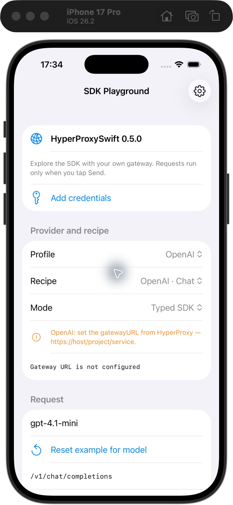

# SDK Playground

A runnable **SwiftUI + MVVM** iOS example for exploring HyperProxySwift through
your own HyperProxy gateway. Select a provider, edit a request, inspect a response,
and compare typed SDK calls with raw JSON, SSE, multipart, and WebSocket transport.



## Run

1. From the SDK repository root, prepare your ignored local configuration:

   ```sh
   python3 Examples/Playground/Scripts/prepare_config.py
   ```

2. In `Profiles.local.json`, set `gatewayURL` and `appKey` for the profiles you
   want to use. Copy the full service URL from your HyperProxy dashboard.
   Add your **provider API key** under that service's **Keys** tab; put the returned
   **HyperProxy app key** in this file. Other profiles can remain empty.
3. Open `Playground.xcodeproj`, select the **Playground** scheme, and run on an
   iOS 17+ simulator or device. Use Xcode with Swift 6.2 or later.

The project opens directly; no project-generation tool is needed. Its package uses
`.package(path: "../..")`, so it builds the **surrounding SDK checkout**. To test
a published SDK version, check out that tag first. A future tag must contain this
example to include it; it is not retroactively added to the 0.5.0 release.

The app opens with empty configuration and disables sending until a gateway URL
and app key are present. Building, launching, selecting a profile, and resetting
an example do not send AI requests.

### Configuration

`Profiles.example.json` has empty credentials and no account-specific URLs.
The preparation script creates `Profiles.local.json` with permissions `0600` and
preserves an existing file. The build copies local profiles into the app bundle;
without a local file, it copies the empty example instead.

- **gatewayURL:** the full HTTPS URL for your service, without an endpoint suffix,
  query string, or credentials in the URL.
- **appKey:** a complete `hp_test_…` or `hp_live_…` app key, including both dots.
  A provider secret such as `sk-…` or an observability ingest token cannot replace it.
- **models:** optional defaults keyed by recipe ID, such as `openAIChat` or
  `geminiContent`. Provider model availability depends on your account.
- **timeout:** optional timeout in seconds, from 1 to 600; defaults to 120.
- **attestation:** `none`, `simulatorBypass`, `deviceToken`, or `assertion`, matching
  your test service's security policy. `simulatorBypass` also requires your project's
  `simulatorBypassToken`.

Do not weaken a production service to run the example. App Attest requires a
physical device, your signing team, an owned bundle ID, and matching Apple settings
in the HyperProxy project. Follow the [device security probe](../DeviceSecurityProbe)
for hardware verification and the [security guide](../../Documentation/UsageGuide.md#devicecheck).
WebSockets should use cached device-token protection rather than per-body assertions.

After changing local profiles, rebuild the app. **Setup → Import profiles JSON**
loads a replacement configuration without rebuilding, until the app restarts.
Local profiles are ignored by Git, but the bundle contains them: keep this build
for personal testing rather than distributing a credential-bearing example app.

## Open the screen in another app

Add the local Swift package at `Examples/Playground` to your iOS 17+ test target
and link its **HyperProxyPlayground** product. The screen, view model, recipes,
and transport stay in this package; the host only opens the view:

```swift
import HyperProxyPlayground
import SwiftUI

// Inside an App's body:
WindowGroup { HyperProxyPlaygroundView() }
```

For a UIKit test host, present the same screen with a `UIHostingController`:

```swift
import HyperProxyPlayground
import SwiftUI

// Inside a UIViewController:
present(UIHostingController(rootView: HyperProxyPlaygroundView()), animated: true)
```

The default initializer reads `Profiles.json` from the **host app's bundle**.
Include your ignored local configuration as that resource, or use
**Add credentials → Import profiles JSON** after opening the screen. For a separate
resource bundle, pass `HyperProxyPlaygroundView(profilesBundle: yourBundle)`.
The screen does not change the host's global SDK logging configuration; SDK logging
defaults to off. Keep body logging disabled when testing with credentials.

This optional UI product belongs to the example package, keeping SwiftUI and UIKit
out of the SDK's Core product. It is available from the current local checkout;
the published 0.5.0 tag predates this example. The UI is iOS-only; model and transport
tests also run on macOS.

## What to try

| Provider | Recipes |
| --- | --- |
| OpenAI | Chat, Responses, images, TTS, transcription, Realtime WebSocket |
| Anthropic | Messages |
| Gemini | Content, images |
| DeepSeek, Mistral, xAI, Novita, Z.AI | Chat |
| Perplexity | Sonar, Agent |
| Black Forest Labs | Generate image, Poll result |
| Any profile | Custom JSON POST request |

**Typed SDK** validates request and response DTOs for OpenAI Chat / Responses,
Anthropic Messages, and Gemini Content. A response decoding failure retains its
original body and Request ID. **JSON / binary** preserves provider-specific fields.
**SSE** displays raw events; **Multipart** uploads an audio file up to 25 MB;
**WebSocket** connects and lets you send JSON after the first provider event.

The model field does not silently overwrite edited JSON. Change the model, then
tap **Reset example for model** to update the request body, endpoint path, and query.
Endpoint paths are relative to the gateway. Query JSON accepts string values.

For Realtime, allow `/v1/realtime` in your service's endpoint list, connect, and
wait for `session.created` before sending the prepared message. Microphone capture
and realtime audio playback are outside this example; use `HyperProxyRealtimeAudio`
for those features. Perplexity Sonar and Agent use the same service/profile.

BFL image generation is asynchronous: copy the returned generation ID into the
**Poll result** query, then send a poll manually. The app never polls automatically.
Ordinary JSON image results preview the first image; OpenAI streaming image payloads
remain inspectable as event JSON. TTS binary responses can be played on the device.

## MVVM structure

| Layer | Responsibility |
| --- | --- |
| `App/PlaygroundApp.swift` | Standalone launcher calling the reusable screen |
| `Sources/HyperProxyPlayground/HyperProxyPlaygroundView.swift` | Public SwiftUI screen, bindings, pickers, and file-picker presentation |
| `Sources/HyperProxyPlayground/PlaygroundViewModel.swift` | Main-actor state, user actions, file loading, run lifecycle, cancellation, and media presentation |
| `Sources/PlaygroundKit` | Configuration and request models, recipes, output formatting, and SDK transport |
| `Tests/PlaygroundKitTests` | Request/authentication contracts and deterministic transport tests |

The view delegates provider API calls and configuration-file loading to the view
model. SwiftUI handles result-image loading as presentation. The view model
delegates request construction and provider transport to `PlaygroundKit`.
SDK transport owns gateway authentication; this example does not add a direct-provider
fallback. Only Core, OpenAI, Anthropic, and Gemini products are linked; other recipes
demonstrate the Core transport with provider-native JSON.

## Inspect a run

The response section displays status, duration, Request ID, headers, events, and the
original response body. **Copy report** preserves the last run's context even if you
select another profile. Configured app keys and bypass tokens are redacted, sensitive
headers are masked, and SDK body logging defaults to disabled. Response/prompt content is still
part of a report: review it before sharing. Output is capped at 200,000 characters;
streams retain their latest events.

In HyperProxy, look for session **SDK Playground**, `source=sdk-playground`, and
Client ID `sdk-playground`. **New session** creates another opaque session ID.
Token counts and prices come from the actual provider/gateway usage, not a local estimate.

Each manually sent request can incur provider charges and consume gateway quota.
Automatic retries are disabled. **Stop** cancels the local transport; entering the
background stops transport and audio playback. Cancellation cannot reverse provider
work or charges already incurred.

## Verify without credentials

From the repository root:

```sh
swift test --package-path Examples/Playground --scratch-path .build
xcodebuild -project Examples/Playground/Playground.xcodeproj \
  -scheme Playground -destination 'generic/platform=iOS Simulator' \
  build CODE_SIGNING_ALLOWED=NO
```

Tests use URLProtocol fixtures and never call paid APIs. CI checks both the model /
transport tests and the iOS Simulator build. Live provider requests and physical-device
attestation require your own configuration and manual testing.
